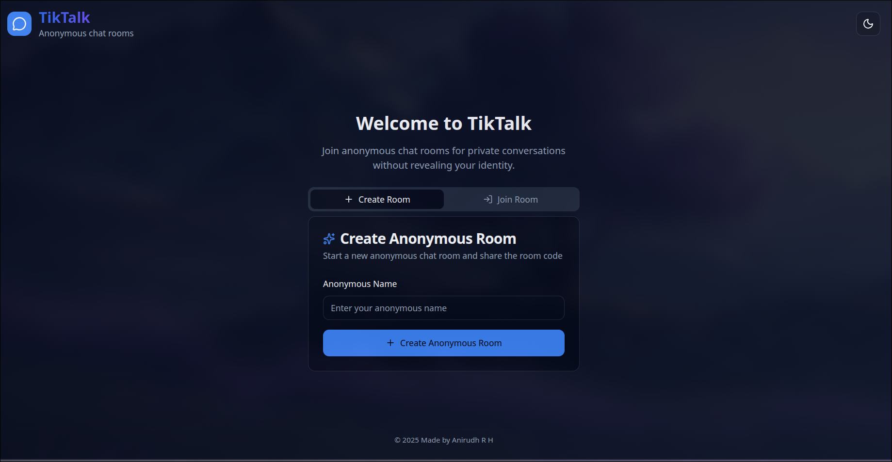
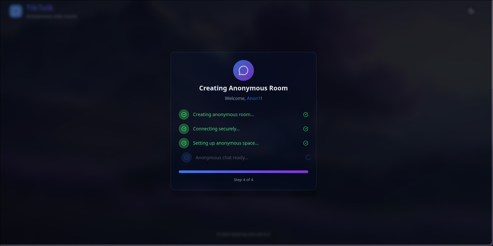
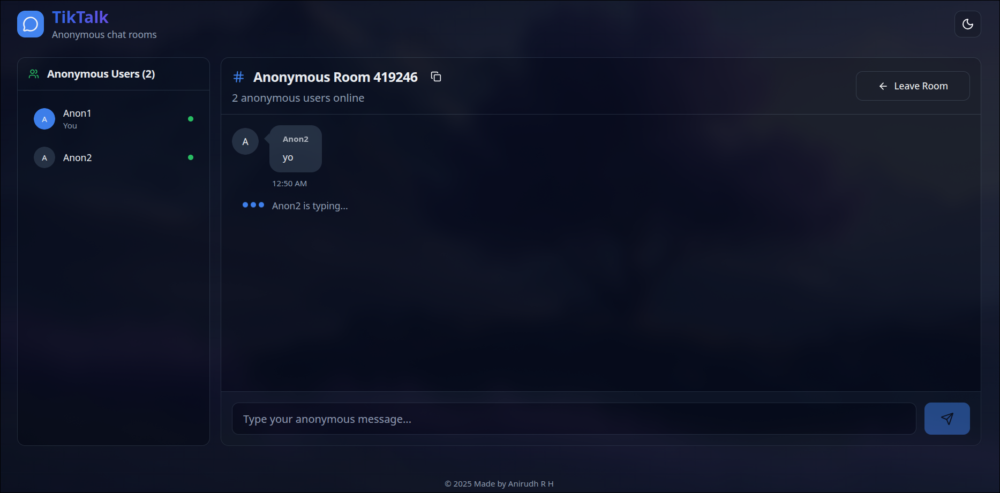

## 💬 TikTalk - Anonymous Real-time Chat Application 💬 TikTalk - Real-time Chat Application

<div align="center">
  
  
  **A modern, anonymous real-time chat application built with React and Socket.IO**
  
  [](https://github.com/a9irudhh)
  [](./LICENSE)
  [](https://reactjs.org/)
  [](https://socket.io/)
</div>

## 🌟 Features

- **🚀 Anonymous messaging** - Instant communication without revealing identity
- **🏠 Create & Join anonymous rooms** - Easy room creation with 6-digit room codes
- **👥 Anonymous participants** - See who's online without personal information
- **💡 Anonymous typing indicators** - Know when others are typing
- **🎨 Modern UI** - Beautiful interface with dark/light theme support
- **📱 Responsive design** - Works seamlessly on desktop and mobile
- **⚡ Loading animations** - Smooth user experience with loading states
- **🔒 Room cleanup** - Automatic memory optimization and room management
- **🌍 CORS support** - Production-ready with proper CORS configuration
- **🕵️ Complete anonymity** - No personal data required or stored

## 📸 Screenshots

### Landing Page


### Room Creation


### Live Chat


## 🛠️ Tech Stack

### Frontend
- **React 19.1.1** - Modern React with hooks
- **TypeScript** - Type-safe development
- **Vite** - Fast build tool and dev server
- **Tailwind CSS** - Utility-first CSS framework
- **Radix UI** - Accessible component primitives
- **Socket.IO Client** - Real-time communication
- **Lucide React** - Beautiful icons

### Backend
- **Node.js** - JavaScript runtime
- **Express.js** - Web application framework
- **Socket.IO** - Real-time bidirectional communication
- **CORS** - Cross-origin resource sharing
- **ES6 Modules** - Modern JavaScript modules

## 🚀 Quick Start

### Prerequisites
- Node.js (v18 or higher)
- npm or yarn
- Git

### Installation

1. **Clone the repository**
   ```bash
   git clone https://github.com/a9irudhh/tiktalk.git
   cd tiktalk
   ```

2. **Setup Backend**
   ```bash
   cd backend
   npm install
   ```

3. **Setup Frontend**
   ```bash
   cd ../frontend/vite-project
   npm install
   ```

### Development

1. **Start the backend server**
   ```bash
   cd backend
   npm start
   ```
   Server will run on `http://localhost:8000`

2. **Start the frontend development server**
   ```bash
   cd frontend/vite-project
   npm run dev
   ```
   Frontend will run on `http://localhost:3000`

3. **Open your browser** and navigate to `http://localhost:3000`

## 🌐 Deployment

### Backend Deployment (Render)
1. Create a new web service on [Render](https://render.com)
2. Connect your GitHub repository
3. Set build command: `cd backend && npm install`
4. Set start command: `cd backend && npm start`
5. Add environment variables:
   - `FRONTEND_URL`: Your frontend deployment URL
   - `PORT`: 8000 (or leave default)

### Frontend Deployment (Vercel)
1. Create a new project on [Vercel](https://vercel.com)
2. Connect your GitHub repository
3. Set framework preset to "Vite"
4. Set root directory to `frontend/vite-project`
5. Add environment variable:
   - `VITE_BACKEND_URL`: Your backend deployment URL

## 📁 Project Structure

```
tiktalk/
├── backend/                    # Node.js backend
│   ├── src/
│   │   └── index.js           # Main server file
│   ├── package.json
│   └── README.md
├── frontend/
│   └── vite-project/          # React frontend
│       ├── src/
│       │   ├── components/    # UI components
│       │   │   ├── ui/        # Radix UI components
│       │   │   ├── LoadingSteps.tsx
│       │   │   ├── LoadingButton.tsx
│       │   │   ├── SuccessAnimation.tsx
│       │   │   ├── mode-toggle.tsx
│       │   │   └── theme-provider.tsx
│       │   ├── lib/
│       │   │   └── utils.ts   # Utility functions
│       │   ├── App.tsx        # Main app component
│       │   └── main.tsx       # Entry point
│       ├── public/
│       │   ├── favicon.ico    # Favicon
│       │   └── favicon.png
│       ├── package.json
│       └── vite.config.ts
├── static/                    # Demo images
│   ├── landing_page.png
│   ├── room_creation.png
│   └── texting.png
├── LICENSE
└── README.md
```

## 🔧 Configuration

### Environment Variables

#### Backend (.env)
```env
FRONTEND_URL=http://localhost:3000
PORT=8000
```

#### Frontend (.env)
```env
VITE_BACKEND_URL=http://localhost:8000
```

## 🎯 Key Features Explained

### Anonymous Chat System
- **No Registration Required**: Jump straight into anonymous conversations
- **Temporary Identities**: Use any name without account creation
- **No Data Storage**: Messages and user data are not permanently stored
- **Complete Privacy**: No tracking or personal information collection

### Room Management
- **Room Creation**: Generate 6-digit room codes automatically for anonymous rooms
- **Room Joining**: Join existing anonymous rooms with room codes
- **Automatic Cleanup**: Empty rooms are automatically deleted when the last user leaves
- **Memory Optimization**: Periodic cleanup of stale connections

### Real-time Communication
- **Instant Anonymous Messaging**: Messages appear immediately for all participants
- **Anonymous Typing Indicators**: See when other anonymous users are typing
- **Live Participants**: Real-time anonymous participant count and list
- **Connection Management**: Graceful handling of disconnections

### User Experience
- **Loading States**: Beautiful loading animations during anonymous room operations
- **Success Feedback**: Confirmation animations for successful anonymous actions
- **Error Handling**: Clear error messages for better UX
- **Responsive Design**: Optimized for all screen sizes
- **Privacy First**: Designed with anonymity and privacy as core principles

## 🔌 API Endpoints

### WebSocket Events

#### Client → Server
- `join` - Join an anonymous chat room
- `chat` - Send an anonymous message
- `typing` - Indicate typing status anonymously
- `exit` - Leave an anonymous room
- `getAllNames` - Get all anonymous user names

#### Server → Client
- `joinConfirmed` - Confirm successful anonymous room join
- `participants` - Updated anonymous participant list
- `chat` - Receive an anonymous message
- `typing` - Anonymous typing indicator from other users
- `error` - Error messages

### HTTP Endpoints
- `GET /` - Health check
- `GET /stats` - Anonymous room statistics (total users, rooms, etc.)

## 🤝 Contributing

1. Fork the repository
2. Create a feature branch (`git checkout -b feature/amazing-feature`)
3. Commit your changes (`git commit -m 'Add some amazing feature'`)
4. Push to the branch (`git push origin feature/amazing-feature`)
5. Open a Pull Request

## 📝 License

This project is licensed under the MIT License - see the [LICENSE](LICENSE) file for details.

## 👨‍💻 Author

**Anirudh R H**
- GitHub: [@a9irudhh](https://github.com/a9irudhh)

## 🙏 Acknowledgments

- [Socket.IO](https://socket.io/) for real-time communication
- [Radix UI](https://www.radix-ui.com/) for accessible components
- [Tailwind CSS](https://tailwindcss.com/) for styling
- [Lucide](https://lucide.dev/) for beautiful icons
- [Vite](https://vitejs.dev/) for fast development experience

---

<div align="center">
  <p>Made with ❤️ by Anirudh R H</p>
  <p>⭐ Star this repo if you find it helpful!</p>
</div>
